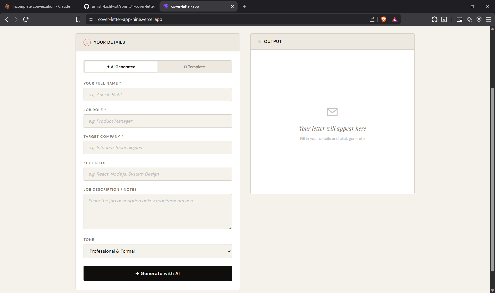
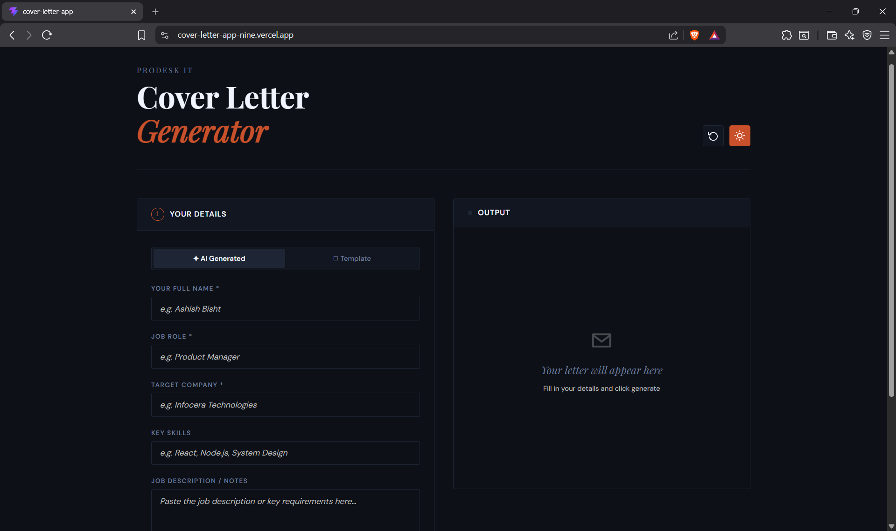
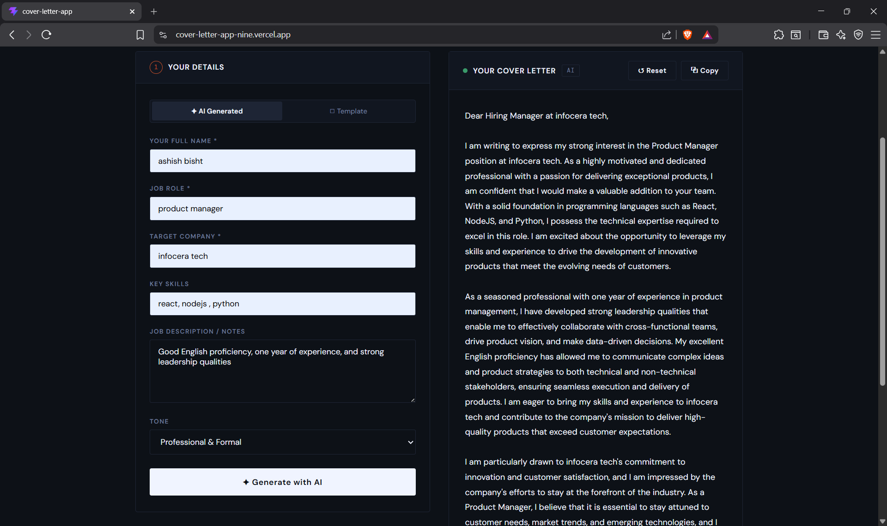

# AI Cover Letter Generator 🚀

A modern SaaS utility built with **React + Vite** that generates professional cover letters using AI. Features both a smart template engine and live AI generation powered by the **Groq API (LLaMA 3.3 70B)**.

---

## 📸 Screenshots

### Light Mode


### Dark Mode


### AI Generated Output


---

## ✨ Features

- **Phase 1 — Template Engine** — Instantly generates a formatted cover letter by interpolating form fields into a professional template
- **Phase 2 — AI Integration** — Connects to the Groq API using LLaMA 3.3 70B to generate highly personalized, context-aware cover letters
- **Dark / Light Mode** — Toggle between themes with a single click
- **Copy to Clipboard** — One-click copy with toast confirmation
- **Reset Form** — Clear all fields instantly from the header
- **Loading State** — Animated spinner and dots while AI generates
- **Tone Selection** — Choose between Professional, Enthusiastic, or Concise tone
- **Fully Responsive** — Works on desktop and mobile

---

## 🛠️ Tech Stack

| Technology | Purpose |
|---|---|
| React 18 | Frontend framework |
| Vite 8 | Build tool & dev server |
| Groq API | AI text generation (LLaMA 3.3 70B) |
| Vercel | Deployment & hosting |
| Vanilla CSS | Styling with CSS variables |

---

## 🚀 Getting Started

### 1. Clone the repository

```bash
git clone https://github.com/ashish-bisht-iot/sprint04-cover-letter.git
cd sprint04-cover-letter
```

### 2. Install dependencies

```bash
npm install
```

### 3. Set up environment variables

Create a `.env` file in the root of the project:

```
VITE_GROQ_API_KEY=your_groq_api_key_here
```

Get a free API key from [console.groq.com](https://console.groq.com)

> ⚠️ Never commit your `.env` file. It is already in `.gitignore`.

### 4. Run the development server

```bash
npm run dev
```

Open [http://localhost:5173](http://localhost:5173) in your browser.

---

## 🔐 Security

- API key is stored in `.env` and excluded from version control via `.gitignore`
- Environment variable is prefixed with `VITE_` for Vite compatibility
- On Vercel, the key is stored as an encrypted environment variable

---

## 📦 Build & Deploy

### Build for production

```bash
npm run build
```

### Deploy to Vercel

```bash
npx vercel --prod
```

---

## 🌐 Live Demo

| Project | URL |
|---|---|
| Cover Letter App | [cover-letter-app-nine.vercel.app](https://cover-letter-app-nine.vercel.app) |
| Infocera RFP Redesign | [infocera-rfp.vercel.app](https://infocera-rfp.vercel.app) |

---

## 📁 Project Structure

```
sprint04-cover-letter/
├── public/
│   └── favicon.svg
├── src/
│   ├── App.jsx          # Main component — all UI + logic
│   ├── main.jsx         # React entry point
│   └── index.css        # Empty (styles live in App.jsx)
├── screenshots/         # App screenshots for README
├── .env                 # API key (not committed)
├── .gitignore
├── Prompts.md           # AI usage log
├── package.json
└── vite.config.js
```

---

## 📝 How It Works

1. Fill in your **Name**, **Job Role**, **Target Company**, **Key Skills**, and optionally a **Job Description**
2. Select your preferred **Tone**
3. Choose **AI Generated** or **Template** mode
4. Click **Generate** — AI mode calls the Groq API with a programmatic prompt; Template mode interpolates your data into a pre-built structure
5. Copy the output with one click

---

